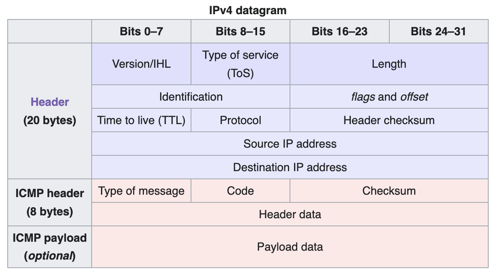
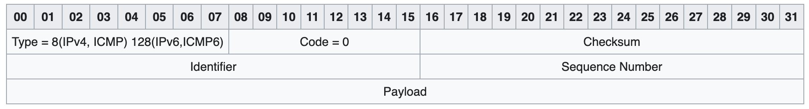
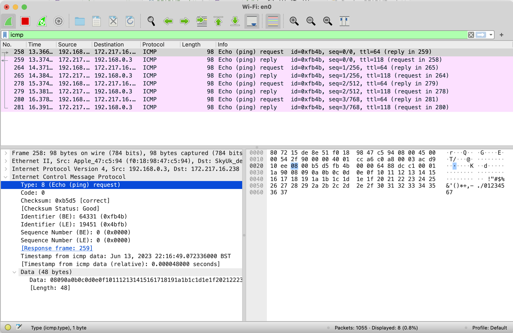
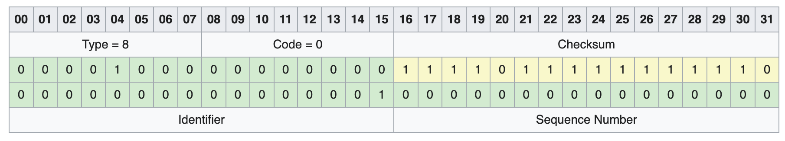
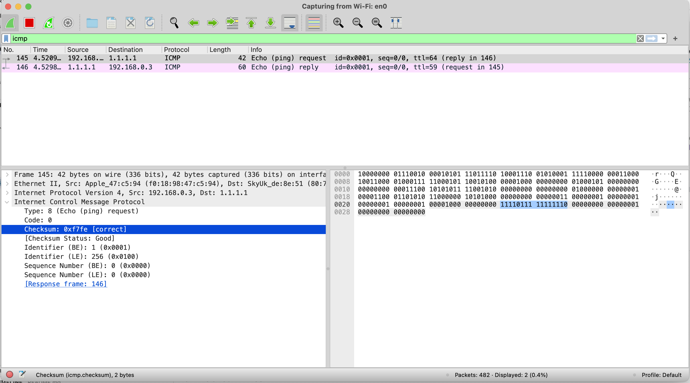
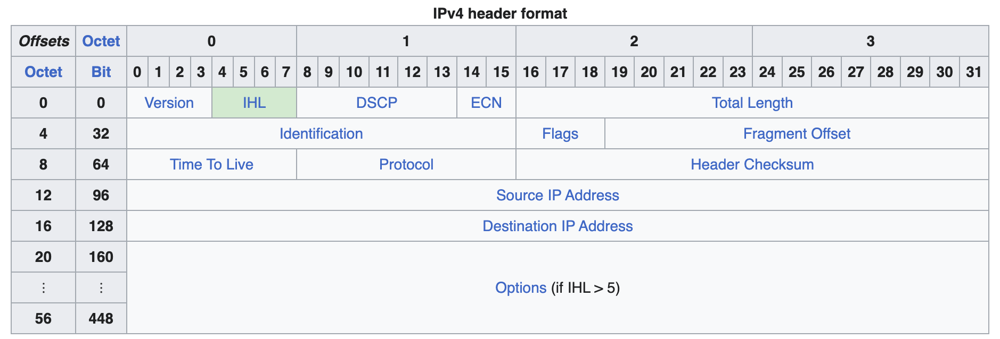

# Building ping command in Node.js for fun. Short practical guide to Wireshark, buffers, sockets, and bit manipulation

I find exploring some unknown things helpful in understanding how the system works. You probably used the `ping` command multiple times to test the connection to the server. This is a widely available tool. Have you ever thought about how exactly it works and how to implement it yourself?

In this article, I'll share my learning on implementing some low-level binary protocols using `ping` as an example. I'll share some tips on debugging, using binary protocols, and manipulating bits for the greater good. So let's dive in.

## What is ping?

"`ping` is a computer network administration software utility used to test the reachability of a host on an Internet Protocol (IP) network... Ping measures the round-trip time for messages sent from the originating host to a destination computer that are echoed back to the source." (c) [wiki](<https://en.wikipedia.org/wiki/Ping_(networking_utility)>)

Let's give it a try. Just open a terminal and execute `ping 1.1.1.1`. You should see something similar to this:

```cli
$ ping 1.1.1.1
PING 1.1.1.1 (1.1.1.1): 56 data bytes
64 bytes from 1.1.1.1: icmp_seq=0 ttl=59 time=8.322 ms
64 bytes from 1.1.1.1: icmp_seq=1 ttl=59 time=19.255 ms
64 bytes from 1.1.1.1: icmp_seq=2 ttl=59 time=7.433 ms
...
```

Behind the scenes, we send ICMP packets to [1.1.1.1](https://en.wikipedia.org/wiki/1.1.1.1) and await a response. At the same time, we measure the time it takes, TTL, and some statistics across all requests. There is a high chance that you never heard about [ICMP](https://en.wikipedia.org/wiki/Internet_Control_Message_Protocol) packets before. This protocol is primarily used by network devices to share operational information. It differs from more common TCP and UDP protocols but works on the same [IP](https://en.wikipedia.org/wiki/Internet_Protocol) stack. Sounds fun, let's dive into implementation details.

Let's take a look at the protocol description on [wiki](<https://en.wikipedia.org/wiki/Ping_(networking_utility)#Message_format>). We will focus on IPv4 for simplicity, but it works similarly for IPv6.

Full IPv4 message


A lot is going on here. However, most of the work will be done automatically for us by OS or socket library. Let's focus on the red parts that we will have to implement ourself.



Now we need to figure how to send those bits and bytes

## Test it/debug it/Wireshark it!

So now we have a good theory behind us to get started. However, to debug our program, it would be helpful to see the actual bits and bytes we send to some IPs. The easiest way to check ANY traffic your machine is using is to use [Wireshark](https://www.wireshark.org/download.html). It is free and open-source software that works on both Windows and macOS. Before we start, let's check if theory and practice align on how the protocol works.

Two easy steps:

1. Start Wireshark and choose what to capture (in my case wifi that is connected to the Internet)
2. Add filter icmp in the top bar as it will produce a lot of noise

This is more or less what you will see



Wireshark is quite powerful and knows how to handle ICMP commands. It will be very helpful to validate our setup. You can also hover over Packet Bytes to highlight what they are responsible for. In this case, you can see the Type of request is equal to 8, which is exactly what we would expect from our protocol description above.

## Let's code

Now we have all the building blocks; we can start coding. Unfortunately, node.js has no native support for raw sockets to use ICMP protocol. However, the `raw-socket` npm package supports it using [node-gyp](https://github.com/nodejs/node-gyp) to access system-level APIs.

So practically, we need to:

1. create socket
2. subscribe to messages
3. send messages

```js
import raw from "raw-socket";

const socket = raw.createSocket({ protocol: raw.Protocol.ICMP });

socket.on("message", function (buffer, source) {
  // TODO Decode
});

socket.on("error", (e) => {
  console.error("Socket Error: ", e);
  socket.close();
});

const pingBuffer = createPingBuffer(1234, 0, "Payload");
socket.send(pingBuffer, 0, buffer.length, "1.1.1.1", function (error, bytes) {
  if (error) console.error("Unable to send message: ", error.toString());
});

function createPingBuffer(identifier, sequence, payload) {
  // TODO Encode
}
```

This is the main part of the app. Here we create an ICMP socket and start listening for new messages. At the same time, we send our ping command to the `1.1.1.1` IP address.

So now we need to implement encoding and decoding of the messages

### Encoding ping protocol

As you saw in the diagram above, we must provide 8 bytes of information: Type, Code, Checksum, Identifier, and Sequence Number. We can also provide an optional payload that will be returned to us in the response. This will be helpful later.

So minimal ping request will look as follows:



```
Type = 8 (Request) = 00001000 (binary)
Code = 0 = 00000000 (binary)
Checksum = dynamic value
Identifier = 1 = 0000000000000001 (binary)
Sequence Number = 0 = 0000000000000000 (binary)
```

For clarity we show this information in multiple rows with nice table. But just to be clear what we actually send is the following 64 bits:

```
0000100000000000111101111111111000000000000000010000000000000000
```

The easiest way to manipulate bits is to use Node.js [Buffers](https://nodejs.org/api/buffer.html). It is a subclass of JavaScript's Uint8Array and adds helpful methods to manipulate raw bytes.

```js
const ICMP_HEADER_SIZE = 8;

function createPingBuffer(identifier, sequenceNumber, payload) {
  // Allocate empty 8 bytes buffer filled with 0
  const buffer = Buffer.alloc(ICMP_HEADER_SIZE);

  buffer.writeUInt8(8, 0); // Type 1 byte with offset 0 bytes
  buffer.writeUInt8(0, 1); // Code 1 byte with offset 1 byte
  buffer.writeUInt16BE(0, 2); // Checksum 2 bytes with offset 2 bytes
  buffer.writeUInt16BE(identifier, 4); // Identifier 2 bytes with offset 4 bytes
  buffer.writeUInt16BE(sequenceNumber, 6); // Sequence Number 2 bytes with offset 6 bytes

  // Override 0 checksum with correct value based on full request
  raw.writeChecksum(buffer, 2, raw.createChecksum(buffer));

  return buffer;
}
```

That is it! We should be able to send ping requests now. Let's check if it works using Wireshark.



As you can see, it works as expected, and we were able to send a request. However, we still need to decode a response

### Decode ping protocol

We can use similar helper methods on the Buffer class to decode the ping packet. However, there is a caveat. We will get a full IP protocol packet as a response. Yet, IP protocol has a dynamic header size. It means we will have to find where our ping message starts.

Let's take a closer look at the datagram



IHL stands for [Internet Header Length ](https://en.wikipedia.org/wiki/Internet_Protocol_version_4#IHL). It has 4 bits that specify the number of 32-bit (4 bytes) words in the header. Unfortunately, node.js Buffers lacks helper methods to read 4-bit data. It means that we will have to implement it ourselves.

Here we will need to use [bitwise operations](https://developer.mozilla.org/en-US/docs/Web/JavaScript/Reference/Operators/Bitwise_AND). To get the last 4 bits of a byte, we will need to use bitwise `AND`

```js
function getIPProtocolHeaderSize(buffer) {
  const versionAndIHL = buffer.readInt8();
  const IHL = versionAndIHL & 0b00001111; // will remove everything in the first 4 bits -> 0x0000XXXX
  return IHL * 4; // multiply by 4 as it contains number of 32-bit (4 bytes) words to get total size in bytes
}
```

Now we have everything we need to decode a response

```js
function decodePingPacket(buffer) {
  const ipOffset = getIPProtocolHeaderSize(buffer);

  // IP level TTL
  const ttl = buffer.readUInt8(8);

  const type = buffer.readUInt8(ipOffset);
  const code = buffer.readUInt8(ipOffset + 1);
  const checksum = buffer.readUInt16BE(ipOffset + 2);
  const identifier = buffer.readUInt16BE(ipOffset + 4);
  const sequenceNumber = buffer.readUInt16BE(ipOffset + 6);

  return {
    ttl,
    type,
    code,
    checksum,
    identifier,
    sequenceNumber,
  };
}
```

That is it! We need to precisely measure the time between request and response to have a fully functional ping client.

### Time measurement

If you pay closer attention to the original ping implementation, you will notice a special trick to make our client stateless and don't require us to track state for request/response time as ping protocol requires sending back the same payload we send as part of the request. We can send time as part of the payload! This is what the original UNIX implementation did.

Unix implementation of ping is open source, so we can learn some tricks from reading [source code](https://github.com/dspinellis/unix-history-repo/blob/BSD-4_3/usr/src/etc/ping.c#L233). Here, it adds `timeval` as part of the payload.

```
struct timeval {
  time_t      tv_sec;     /* seconds */
  suseconds_t tv_usec;    /* microseconds */
};
```

Let's use the same approach in our client. We will send a precise time when we send the command and compare it when we get a response. Standard Date.now() will not work well in this case as we deal with high-precision data. To get accurate time, we can use [Performance](https://nodejs.org/api/globals.html#performance) API. So let's put it into practice and add it to the payload together with the payload itself.

```js
const time = performance.timeOrigin + performance.now();

const uint32 = new Uint32Array(2);
uint32[0] = time / 1000;
uint32[1] = (time - uint32[0] * 1000) * 1000;

// write it as first 8 bytes of payload
buffer.writeUInt32BE(uint32[0], 8);
buffer.writeUInt32BE(uint32[1], 12);

// write payload itself
buffer.write(payload, 16);

// compute checksum
raw.writeChecksum(buffer, 2, raw.createChecksum(buffer));

return buffer;
```

## Conclusion

I intentionally simplified some things and cut some corners. Ideally, we will need to add error logging, keep track of statistics, etc. We also need to make sure to filter out all other ICMP packets that are not part of our ping request by [checking the type of request and identifier](https://github.com/dspinellis/unix-history-repo/blob/BSD-4_3/usr/src/etc/ping.c#L335).

However, I hope it was an interesting journey on how to implement low-level binary protocols, measure time, debug network requests, do bit manipulations, and read the source code.

I put together all the code here in [this repo](https://github.com/dlitsman/ping-nodejs). It has some extra code to connect all the pieces together. Just run

```
$ node index.js 1.1.1.1
PING 1.1.1.1 (1.1.1.1): 28 data bytes
36 bytes from 1.1.1.1: icmp_seq=0 ttl=59 time=32.622314453125 ms
36 bytes from 1.1.1.1: icmp_seq=1 ttl=59 time=9.591552734375 ms
36 bytes from 1.1.1.1: icmp_seq=2 ttl=59 time=16.101806640625 ms
...
```
