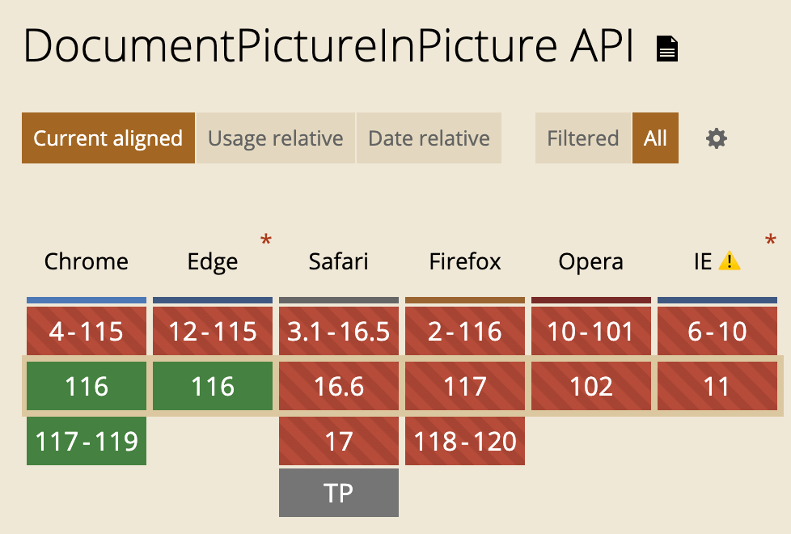

# Document Picture-in-Picture in React

[Picture-in-picture API](https://developer.mozilla.org/en-US/docs/Web/API/Picture-in-Picture_API) is available in most of the browsers for quite some time. However, the main downise was that developers have very limited control over custom controls and look and feel of it, as it only allows to use Video element as PiP element.

Recent updates in Chrome 116 changes that, by adding [Document Picture-in-Picture](https://wicg.github.io/document-picture-in-picture/) support. This creates new possibilities for creating much richer UX. At the time of writing this article this feature is supported only in Chrome and Edge. However, hopefully, other browsers will also add support later.



## API

API for opening picture-in-picture window is very similar to the one you can use for regular `window.open()`. However, there are some important differences:

- The Picture-in-Picture window floats on top of other windows.
- The Picture-in-Picture window never outlives the opening window.
- The Picture-in-Picture window cannot be navigated.
- The Picture-in-Picture window position cannot be set by the website.

You can check more details about raw implementation in [this article](https://developer.chrome.com/docs/web-platform/document-picture-in-picture/).

### 1. Opening

To open new window

```js
const pipWindow = await documentPictureInPicture.requestWindow({
    width: 500, // optional
    heithg: 500, // optional
});

// You have full control over this PiP now
pipWindow.document.body.innerHTML = 'Hello from PiP';
```

### 2. Closing

You can listen for `pagehide` event to detect when PiP window is closing. For example, in case if user decided to close PiP window.

```js
pipWindow.addEventListener("pagehide", (event) => {
    // do something when pip is closed by browser/user
});
```

You can also decide to close window at any moment

```js
pipWindow.close();
```

### 3. Detecting feature
To detect if current runtime supports this API you can use this check:

```js
if ('documentPictureInPicture' in window) {
  // Feature supported
}
```

## Implementing it in React

In the example above we did some manual manipulations with pipWindow document DOM elements. This might be error-prone and hard to support. Alternatively, you can use React to render contents of the window and add interactivity to it.

Let's dive into the code and build a simple counter that users can control using PiP window or the main page.

### Create context

We need a single source of truth to keep track of open window, support of the feature in browser, callbacks to open window, etc. To make it easier to consume, we can make a [Context](https://react.dev/learn/passing-data-deeply-with-context) that will store this information and will make it available for other components in our app.

```ts
type PiPContextType = {
  isSupported: boolean;
  pipWindow: Window | null;
  requestPipWindow: (width: number, height: number) => Promise<void>;
  closePipWindow: () => void;
};

const PiPContext = createContext<PiPContextType | undefined>(undefined);
```

Now let's create a Provider. 

```ts
type PiPProviderProps = {
  children: React.ReactNode;
};

export function PiPProvider({ children }: PiPProviderProps) {
  // Detect if feature is available
  const isSupported = "documentPictureInPicture" in window;

  // Expose pipWindow that is currently active
  const [pipWindow, setPipWindow] = useState<Window | null>(null);

  const closePipWindow = useCallback(() => {
    if (pipWindow != null) {
      pipWindow.close();
      setPipWindow(null);
    }
  }, [pipWindow]);

  const requestPipWindow = useCallback(
    async (width: number, height: number) => {
      // We don't want to allow multiple requests.
      if (pipWindow != null) {
        return;
      }

      const pip = await window.documentPictureInPicture.requestWindow({
        width,
        height,
      });

      pip.onpagehide = () => {
        setPipWindow(null);
      };

      // It is important to copy all parent widnow styles. Otherwise, there would be no CSS available at all
      const allCSS = [...document.styleSheets]
        .map((styleSheet) =>
          [...styleSheet.cssRules].map((r) => r.cssText).join("")
        )
        .filter(Boolean)
        .join("\n");
      const style = document.createElement("style");
      style.textContent = allCSS;
      pip.document.head.appendChild(style);

      setPipWindow(pip);
    },
    [pipWindow]
  );

  const value = useMemo(() => {
    {
      return {
        isSupported,
        pipWindow,
        requestPipWindow,
        closePipWindow,
      };
    }
  }, [closePipWindow, isSupported, pipWindow, requestPipWindow]);

  return <PiPContext.Provider value={value}>{children}</PiPContext.Provider>;
}
```

To make it easier to consume this Context we can also introduce helper hook

```ts
export function usePictureInPicture(): PiPContextType {
  const context = useContext(PiPContext);

  if (context === undefined) {
    throw new Error("usePictureInPicture must be used within a PiPContext");
  }

  return context;
}
```

### Mounting

Now, once we have access to pipWindow we can render to it using React API. Since `pipWindow` is not part of our DOM tree that is managed by React we need to use [createPortal](https://react.dev/reference/react-dom/createPortal) API to render to different DOM element.

Let's create `PiPWindow` component that we can use to render inside newly create Document Picture-in-Picture window

```ts
import { createPortal } from "react-dom";

type PiPWindowProps = {
  pipWindow: Window;
  children: React.ReactNode;
};

export default function PiPWindow({ pipWindow, children }: PiPWindowProps) {
  return createPortal(
    <div className="pipRoot">{children}</div>,
    pipWindow.document.body
  );
}
```

You can now use it in any component. This is minimal example

```ts
function Example() {
  const { isSupported, requestPipWindow, pipWindow, closePipWindow } =
    usePictureInPicture();

  const startPiP = useCallback(() => {
    requestPipWindow(500, 500);
  }, [requestPipWindow]);

  return (
    <div>
      {/* Make sure to have some fallback in case if API is not supported */}
      {isSupported ? (
        <>
          <button onClick={pipWindow ? closePipWindow : startPiP}>
            {pipWindow ? "Close PiP" : "Open PiP"}
          </button>
          {pipWindow && (
            <PiPWindow pipWindow={pipWindow}>Hello in PiP!</PiPWindow>
          )}
        </>
      ) : (
        <div className="error">
          Document Picture-in-Picture is not supported in this browser
        </div>
      )}
    </div>
  );
}
```

This will render Document Picture-in-Picture with our custom component. You can easily add any custom styles or logic there.


You can find full source code and slightly more advanced examples in this repo: [https://github.com/dlitsman/document-pip](https://github.com/dlitsman/document-pip)

Or feel free to give a try to online demo: [https://dlitsman.github.io/document-pip/](https://dlitsman.github.io/document-pip/)

## Conclusion

Document Picture-in-Picture is a great addition to the available APIs browsers provide. It opens new UX posibilities for different domains of apps such as video conferencing, productivity, and more. 

In this article, I've shown one of the ways how this API can be integrated with modern React. 