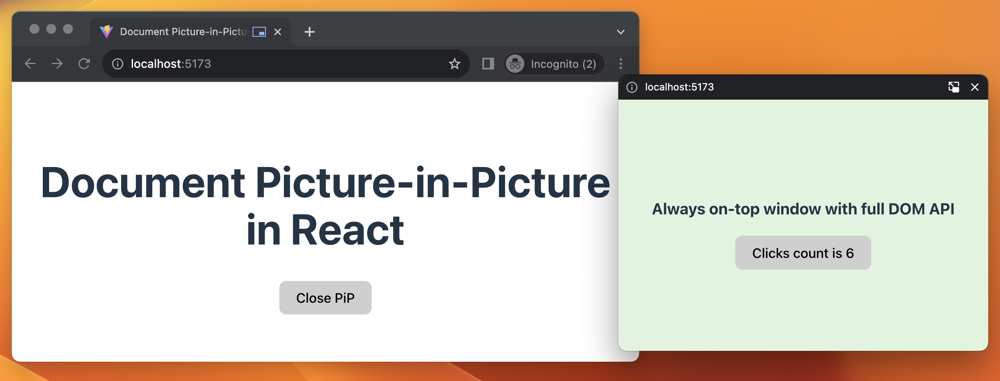
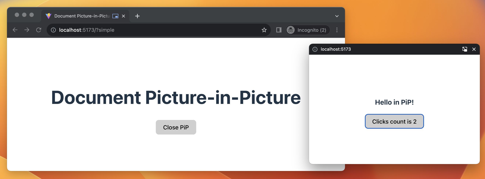
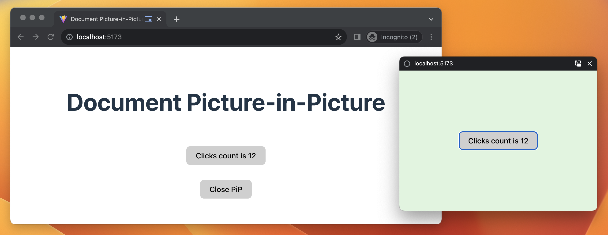

# Document Picture-in-Picture in React



**Live Demo**: [https://dlitsman.github.io/document-pip/](https://dlitsman.github.io/document-pip/)

[Picture-in-picture API](https://developer.mozilla.org/en-US/docs/Web/API/Picture-in-Picture_API) has been available in most of browsers for quite some time. However, the main downside was that developers have very limited control over custom controls and look and feel of it, as it only allows to use Video element as PiP element. This forces developers to use (canvas hacks)[https://developer.chrome.com/blog/watch-video-using-picture-in-picture/#show-canvas-element-in-picture-in-picture-window] for any custom UI.

Recent updates in Chrome 116 change that by adding [Document Picture-in-Picture API](https://wicg.github.io/document-picture-in-picture/) support. This creates new possibilities for creating a much richer UX. At the time of writing this article, this feature is supported only in Chrome and Edge. However, hopefully, other browsers will also add support later.

This is how the [current state of support looks like](https://caniuse.com/mdn-api_documentpictureinpicture)


## API

Let's start by looking at the browser API before adding React integration. For proper integration, we need to support three main operations: opening a window, closing and detecting a close event, and detecting the feature itself.

API for opening picture-in-picture window is very similar to the one you can use for regular `window.open()`. However, there are some important differences:

- The Picture-in-Picture window floats on top of other windows.
- The Picture-in-Picture window never outlives the opening window.
- The Picture-in-Picture window cannot be navigated.
- The Picture-in-Picture window position cannot be set by the website.

You can check more details and full API about raw implementation in [this great article](https://developer.chrome.com/docs/web-platform/document-picture-in-picture/). Below, let's review the core operations we identified before.

### 1. Opening

To open new window

```js
const pipWindow = await documentPictureInPicture.requestWindow({
    width: 500, // optional
    heithg: 500, // optional
});

// You have full control over this PiP now
pipWindow.document.body.innerHTML = 'Hello from PiP';
```

### 2. Closing

You can listen to the `pagehide` event to detect when the PiP window is closing. For example, in case a user decides to close the PiP window.

```js
pipWindow.addEventListener("pagehide", (event) => {
    // do something when pip is closed by the browser/user
});
```

You can also decide to close the window at any moment programmatically:

```js
pipWindow.close();
```

### 3. Detecting feature
To detect if current runtime supports this API you can use this check:

```js
if ('documentPictureInPicture' in window) {
  // Feature supported
}
```

## Implementing Document Picture-in-Picture in React

In the example above, we did some manual manipulations with pipWindow document DOM elements. This might be error-prone and hard to support. Alternatively, React can render the window's content and add interactivity. Especially if you already have React in the app itself.

Let's dive into the code and build React components that will help us render custom components inside a PiP window.

### Create context

We need a single source of truth to keep track of the existing open window, detect support of the feature in a browser, callbacks to open a window, etc. To make it easier to consume, we can make a [Context](https://react.dev/learn/passing-data-deeply-with-context) that will store this information and make it available for other components in our app.

```ts
type PiPContextType = {
  isSupported: boolean;
  pipWindow: Window | null;
  requestPipWindow: (width: number, height: number) => Promise<void>;
  closePipWindow: () => void;
};

const PiPContext = createContext<PiPContextType | undefined>(undefined);
```

Now, let's create a Provider that will implement this API.

```ts
type PiPProviderProps = {
  children: React.ReactNode;
};

export function PiPProvider({ children }: PiPProviderProps) {
  // Detect if the feature is available.
  const isSupported = "documentPictureInPicture" in window;

  // Expose pipWindow that is currently active
  const [pipWindow, setPipWindow] = useState<Window | null>(null);

  // Close pipWidnow programmatically
  const closePipWindow = useCallback(() => {
    if (pipWindow != null) {
      pipWindow.close();
      setPipWindow(null);
    }
  }, [pipWindow]);

  // Open new pipWindow
  const requestPipWindow = useCallback(
    async (width: number, height: number) => {
      // We don't want to allow multiple requests.
      if (pipWindow != null) {
        return;
      }

      const pip = await window.documentPictureInPicture.requestWindow({
        width,
        height,
      });

      // Detect when window is closed by user
      pip.addEventListener("pagehide", () => {
        setPipWindow(null);
      });

      // It is important to copy all parent widnow styles. Otherwise, there would be no CSS available at all
      // https://developer.chrome.com/docs/web-platform/document-picture-in-picture/#copy-style-sheets-to-the-picture-in-picture-window
      [...document.styleSheets].forEach((styleSheet) => {
        try {
          const cssRules = [...styleSheet.cssRules]
            .map((rule) => rule.cssText)
            .join("");
          const style = document.createElement("style");

          style.textContent = cssRules;
          pip.document.head.appendChild(style);
        } catch (e) {
          const link = document.createElement("link");
          if (styleSheet.href == null) {
            return;
          }

          link.rel = "stylesheet";
          link.type = styleSheet.type;
          link.media = styleSheet.media.toString();
          link.href = styleSheet.href;
          pip.document.head.appendChild(link);
        }
      });

      setPipWindow(pip);
    },
    [pipWindow]
  );

  const value = useMemo(() => {
    {
      return {
        isSupported,
        pipWindow,
        requestPipWindow,
        closePipWindow,
      };
    }
  }, [closePipWindow, isSupported, pipWindow, requestPipWindow]);

  return <PiPContext.Provider value={value}>{children}</PiPContext.Provider>;
}
```

To make it easier to consume this Context we can also introduce helper hook

```ts
export function usePiPWindow(): PiPContextType {
  const context = useContext(PiPContext);

  if (context === undefined) {
    throw new Error("usePiPWindow must be used within a PiPContext");
  }

  return context;
}

```

### Mounting

Now, once we have access to pipWindow, we can render it using React API. Since `pipWindow` is not part of our DOM tree that React manages, we need to use [createPortal](https://react.dev/reference/react-dom/createPortal) API to render it to different DOM element.

Let's create a `PiPWindow` component that we can use to render inside the newly created Document Picture-in-Picture window.

```ts
import { createPortal } from "react-dom";

type PiPWindowProps = {
  pipWindow: Window;
  children: React.ReactNode;
};

export default function PiPWindow({ pipWindow, children }: PiPWindowProps) {
  return createPortal(children, pipWindow.document.body);
}
```

You can now use it in any component. This is minimal example

```ts
function Example() {
  const { isSupported, requestPipWindow, pipWindow, closePipWindow } =
    usePiPWindow();

  const startPiP = useCallback(() => {
    requestPipWindow(500, 500);
  }, [requestPipWindow]);

  return (
    <div>
      {/* Make sure to have some fallback in case if API is not supported */}
      {isSupported ? (
        <>
          <button onClick={pipWindow ? closePipWindow : startPiP}>
            {pipWindow ? "Close PiP" : "Open PiP"}
          </button>
          {pipWindow && (
            <PiPWindow pipWindow={pipWindow}>
              <div
                style={{
                  flex: 1,
                  textAlign: "center",
                }}
              >
                <h3>Hello in PiP!</h3>
              </div>
            </PiPWindow>
          )}
        </>
      ) : (
        <div className="error">
          Document Picture-in-Picture is not supported in this browser
        </div>
      )}
    </div>
  );
}
```

This will render the Document Picture-in-Picture with our custom component. You can easily add any custom styles or logic there.



You can find complete source code and slightly more advanced examples in this repo: [https://github.com/dlitsman/document-pip](https://github.com/dlitsman/document-pip). It shows how to render a custom dynamic component that shares a state with a root window.

**Live Demo**: [https://dlitsman.github.io/document-pip/](https://dlitsman.github.io/document-pip/)

Demo with dynamic component example: 

## Conclusion

Document Picture-in-Picture is an excellent addition to the available APIs browsers provide. It opens new UX possibilities for different domains of apps, such as video conferencing, productivity, and more. 

In this article, I've shown how this API can be integrated with modern React using standard Context and Portal API.