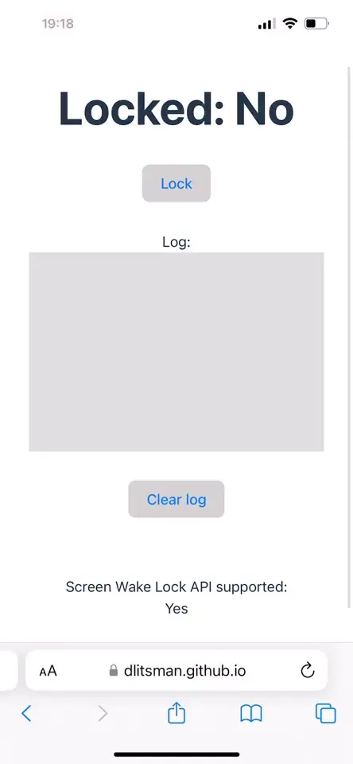

# Using Screen Wake Lock API in React to manage screen locking / dimming in a browser

**TLDR;** [LIVE demo 🚀](https://dlitsman.github.io/react-use-wake-lock/) on how to integrate the [Screen Wake Lock API](https://developer.mozilla.org/en-US/docs/Web/API/Screen_Wake_Lock_API) nto any React application with automatic reacquisition of a lock using [react-use-wake-lock](https://github.com/dlitsman/react-use-wake-lock).

---

Historically browsers didn't support any APIs to control sleep settings. Devices usually turn off displays after some time to improve power usage, improve security, and prolong life of hardware in general. However, this behaviour is not always providing best UX for users. In some cases browsers are smart enough to prevent sleep, by using heuristics like playing video. Some libraries utilize this to hack solution for this problem (e.g. [NoSleep.js](https://github.com/richtr/NoSleep.js)). However, this comes with extra penalty hit on performance and battery.

Modern browsers now support an official API to manage this process. This provides more reliable control over the sleep functionality. In certain scenarios, it's perfectly reasonable to prevent the device from locking (for instance, in systems like navigation, photo galleries, calling, etc.), which significantly enhances the overall user experience.

Although this API is not fully standardized and is still in the [Working Draft](https://www.w3.org/TR/screen-wake-lock/) stage, it has extensive browser support. This is particularly noteworthy since it is now also supported by Safari version 16.4 and above (including mobile Safari). As such, this API is currently [supported by the majority of major browsers](https://developer.mozilla.org/en-US/docs/Web/API/Screen_Wake_Lock_API#browser_compatibility).


Let's take a closer look how to use it in practice and what are the limitations.

## Screen Wake Lock API

There are 3 important limitations when you are allowed to use this api:
1. Your app should be in an active tab
2. You app should be served from [Secure Context](https://developer.mozilla.org/en-US/docs/Web/Security/Secure_Contexts)
3. Using of this feature is not blocked by [Permissions Policy](https://developer.mozilla.org/en-US/docs/Web/HTTP/Permissions_Policy)

The API itself is quite straightforward and involves two steps: requesting a lock and releasing it. Being Promise-based, you need to wait for the promise to resolve in order to acquire the lock.

There are two main parts in the API:
- **WakeLock** - Interface that can be used to request the lock from the browser
- **WakeLockSentinel** - Interface to the underlying lock that can be used to release the lock

So let's connect all the pieces together

### Requesting a lock

To request a lock we need to use `navigator.wakelock` and invoke `request()` method. You need to provide type of lock, but only `screen` type is supported at this moment.

```js
const requestScreenWakeLock = async () => {
  // Check if wakelock API is available
  if (!("wakeLock" in navigator)) {
    console.error("Screen Wake Lock API is not supported by the browser");
    return;
  }

  try {
    const wakeLock = await navigator.wakeLock.request("screen");
  } catch (err) {
    // There are various reason why lock might not be acquired such as tab is not active, low battery on a device, permissions
    console.error(`WakeLock request error: ${err.message}`);
  }
};
```

It's important to note that the browser might reject the request for several reasons, such as low battery level or page visibility, among others. Therefore, it's crucial to ensure that the Promise has been resolved to ensure success.

### Releasing a lock

Once you have a `WakeLockSentinel` from `request()` API you can use it to release a lock. For this you can simple call `release()` method on it and wait for the `Promise` to resolve. You can also check status of a lock in a `released` property and `type`.


The simplest snippet

```js
try {
  console.log('Released state before: 'wakeLock.released); // false

  await wakeLock.release();

  console.log('Released state after: 'wakeLock.released); // true
} catch (err) {
  console.error(`WakeLock release error: ${err.message}`);
}
```

It's important to note that the browser might decide to release the lock even without a specific request from you. Therefore, to keep the state of the app in sync with the lock status, it's crucial to listen for the wake lock release event.

```js
wakeLock.addEventListener("release", () => {
  // the wake lock has been released
  console.log('Wake Lock has been released');
});
```

While the API itself appears quite straightforward, there are some nuances to consider when implementing it. For instance, since the lock will be auto-released when the browser is no longer active, you'll need to manage this aspect yourself. This involves listening for visibility changes in order to reacquire the lock.

For pure JS implementation you can check [MDN example](https://mdn.github.io/dom-examples/screen-wake-lock-api/) and [source code](https://github.com/mdn/dom-examples/blob/main/screen-wake-lock-api/script.js)

However, in order to integrate it into a React-based app it would be much easier to have a wrapper that provides a hook-based API to work with Screen Wake Lock API.

## Using Screen Wake Lock API in React

I have wrapped this API into a React hook to make it much easier to use in any React applications. The [react-use-wake-lock](https://github.com/dlitsman/react-use-wake-lock)  library offers a simple way to hide complexities of handling async nature of Screen Wake Lock API as well as automatically incorporate automatic reacquisition of a lock in case the app loses visibility (becomes inactive). Additionally, it also supports TypeScript and has 100% test-coverage.

Let's take a look at the simplest example.

First, you need to install this library by running `npm install react-use-wake-lock --save` (or `pnpm` / `yarn` depending on your preference)

Then, just add it to your React files as shown in a minimal example below

```ts
import useWakeLock from "react-use-wake-lock";

function MinimalExampleComponent() {
  const { isSupported, isLocked, request, release } = useWakeLock();

  // isSupported: boolean - checks feature is supported by the browser
  // isLocked: boolean    - checks lock is currently active
  // request: () => void  - request lock, once successfully acquired isLocked will change to TRUE
  // release: () => void  - release the lock, once successfully released isLocked will change to FALSE

  return (
    <div>
      <h3>Screen Wake Lock API supported: {isSupported ? "Yes" : "No"}</h3>
      <h3>Locked: {`${isLocked ? "Yes" : "No"}`}</h3>
      <button type="button" onClick={() => (isLocked ? release() : request())}>
        {isLocked ? "Release" : "Request"}
      </button>
    </div>
  );
}
```

This is just a [minimal example](https://dlitsman.github.io/react-use-wake-lock/?min=1). However, library offers more control and error handling by specifying extra options to the hook. Feel free to check [full example code](https://github.com/dlitsman/react-use-wake-lock/blob/main/example/src/App.tsx) or [official documentation](https://github.com/dlitsman/react-use-wake-lock/tree/main?tab=readme-ov-file#usewakelock-api).

You can check this [minimal demo](https://dlitsman.github.io/react-use-wake-lock/?min=1) example or check the [full example with support for events and error handling](https://dlitsman.github.io/react-use-wake-lock/)

End-to-end demo on iOS (Safari)


# Conclusion

Leveraging modern browser APIs is a powerful strategy that allows us to construct a superior user experience, effectively bridging the gap between web and native applications by bringing an app-like feel to web. This article serves as a hands-on guide detailing how to utilize the modern Screen Wake Lock API within any application built on React. You can find the complete source code as well as demo and installation instructions for this example on GitHub [https://github.com/dlitsman/react-use-wake-lock](https://github.com/dlitsman/react-use-wake-lock).

Published:
- https://hackernoon.com/how-to-use-screen-wake-lock-api-in-react-to-manage-screen-lockingdimming-in-a-browser
