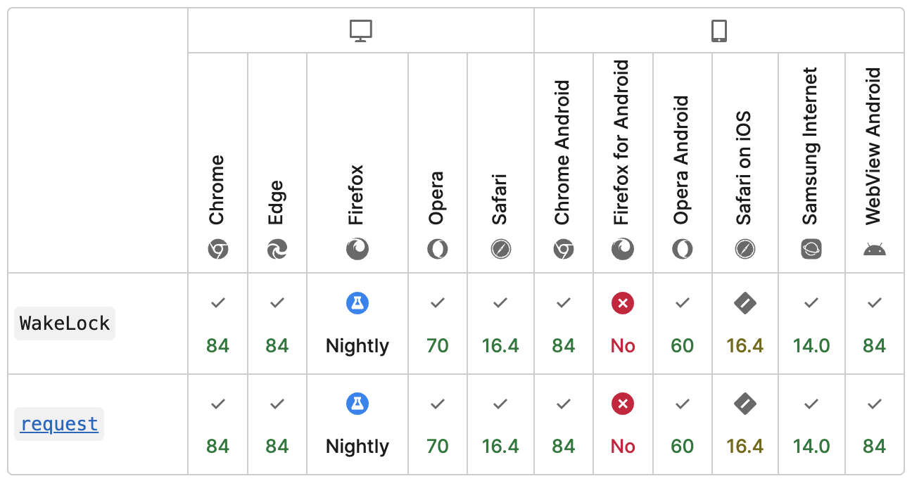

# Using Screen Wake Lock API in React.

**TLDR;** [LIVE demo 🚀](https://dlitsman.github.io/react-use-wake-lock/) To integrate [Screen Wake Lock API](https://developer.mozilla.org/en-US/docs/Web/API/Screen_Wake_Lock_API) to any of React with automatic reaquirning of a lock you can use [react-use-wake-lock](https://github.com/dlitsman/react-use-wake-lock).

---

Historically browsers didn't support any APIs to control sleep settings. Devices usually turn off displays after some time to improve power usage, improve security, and prolong life of hardware in general. However, this behaviour is not always providing best UX for users. In some cases browsers are smart enough to prevent sleep, by using heuristics like playing video. Some libraries utilize this to hack solution for this problem (e.g. [NoSleep.js](https://github.com/richtr/NoSleep.js)). However, this comes to extra penalty hit on performance and battery

Modern browsers now support official API to control this flow. This allows more guarantees to control sleep functionality, as in some cases it is a perfectly valid case to prevent device from locking (e.g., navigation like system, photo gallery, etc.) significantly improving overall UX.

Even though this API is not fully part of the standard, and in the [Working Draft](https://www.w3.org/TR/screen-wake-lock/) state it has good browser coverage. Especially since version 16.4 it is supported in Safari. So currently it is [supported by most of major browsers](https://developer.mozilla.org/en-US/docs/Web/API/Screen_Wake_Lock_API#browser_compatibility).



Let's take a closer look how to use it in practice and what are the limitations.

## Screen Wake Lock API

There are 3 important limitations when you are allowed to use this api
1. Your app should be in an active tab
2. You app should be served from [Secure Context](https://developer.mozilla.org/en-US/docs/Web/Security/Secure_Contexts)
3. Using of this feature is not blocked by [Permissions Policy](https://developer.mozilla.org/en-US/docs/Web/HTTP/Permissions_Policy)

API itself is quite straightforward and consists of two steps: requesting lock and releasing it. The API itsef is Promise based and you need to wait for promise resolution to acquire the lock.

There are 2 main parts in the API
- **WakeLock** - Interface that can be used to request the lock from the browser
- **WakeLockSentinel** - Interface to the underlying lock that can be used to release the lock

So let's connect all the pieces together 

### Requesting a lock

To request a lock we need to use `navigator.wakelock` and invoke `request()` method. You need to provide type of lock, but only `screen` type is supported at this moment.

```js
const requestScreenWakeLock = async () => {
  // Check if wakelock API is available
  if (!("wakeLock" in navigator)) {
    console.error("Screen Wake Lock API is not supported by the browser")  
  }

  try {
    const wakeLock = await navigator.wakeLock.request("screen");
  } catch (err) {
    // There are various reason why lock might not be acquired such as tab is not active, low battery on a device, permissions
    console.error(`WakeLock request error: ${err.message}`);
  }
};
```

It is important to note, that browser might reject request due to several reasons (low battery level, page visibility, etc.). So it is important to check that Promise is resolved.

### Releasing a lock

Once you have a `WakeLockSentinel` from `request()` API you can use it to release a lock. For this you can simple call `release()` method on it and wait for the promise to resolve. You can also check status of a lock in a `released` property and `type`. Another helpful method on a lock you can listen for `release` event to add custom logic in this case.

The simplest snippet

```js
try {
  await wakeLock.release();
} catch (err) {
  console.error(`WakeLock release error: ${err.message}`);
}
```

It is important to note that browser might decide to release lock even without you specifically asking for that. Hence, in order to keep state of the app in sync with lock status it is important to listen for wake lock release event

```js
wakeLock.addEventListener("release", () => {
  // the wake lock has been released
  statusElem.textContent = "Wake Lock has been released";
});
```

Even though API itself seems quite straightforward, there are some caveats to consider when implementing it yourself. For example, as lock will be auto-released when browser is not active anymore you will need to take care of it yourself. You will have to listen for visiblity change in order to reacuare the lock.

For pure JS implementation you can check [MDN example](https://mdn.github.io/dom-examples/screen-wake-lock-api/) and [source code](https://github.com/mdn/dom-examples/blob/main/screen-wake-lock-api/script.js)

However, in order to integrate it to a React-based app it would be much easier to have a wrapper that provides hook based API to work with this API.

## Using Screen Wake Lock API in React

[react-use-wake-lock](https://github.com/dlitsman/react-use-wake-lock) library offers a simple way to hide complexities of handling async nature of Screen Wake Lock API as well as automatically incorporate auto-reacuaring of a lock in case if browser lost visiblity. It also supports TypeScript and has 100% test-coverage.

Let's see the simpliest example

First, you need to install this library by running `npm install react-use-wake-lock --save` (or `pnpm` / `yarn` depending on your preference)

Then, just add it to your React files as shown in a minimal example below

```ts
import useWakeLock from "react-use-wake-lock";

function MinimalExampleComponent() {
  const { isSupported, isLocked, request, release } = useWakeLock();

  return (
    <div>
      <h3>Screen Wake Lock API supported: {isSupported ? "Yes" : "No"}</h3>
      <h3>Locked: {`${isLocked ? "Yes" : "No"}`}</h3>
      <button type="button" onClick={() => (isLocked ? release() : request())}>
        {isLocked ? "Release" : "Request"}
      </button>
    </div>
  );
}
```

This is just a minimal example. However, library offers more control and error handling by specifying extra options to the hook. Feel free to check [full example code](https://github.com/dlitsman/react-use-wake-lock/blob/main/example/src/App.tsx) or [official documentation](https://github.com/dlitsman/react-use-wake-lock/tree/main?tab=readme-ov-file#usewakelock-api).

You can check this minimal demo [here](https://dlitsman.github.io/react-use-wake-lock/?min=1) or check the [full example with support for events and error handling](https://dlitsman.github.io/react-use-wake-lock/)

# Conclusion

Using modern browser API helps us build much better UX and bring app like experience to the web. You can find the full source code as well as demo and installation instructions for this example on GitHub https://github.com/dlitsman/react-use-wake-lock.